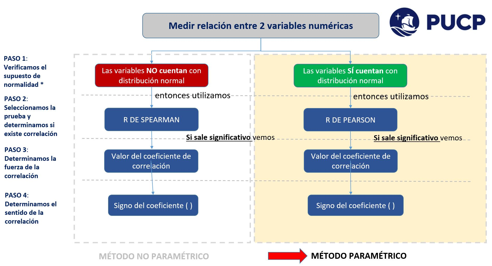
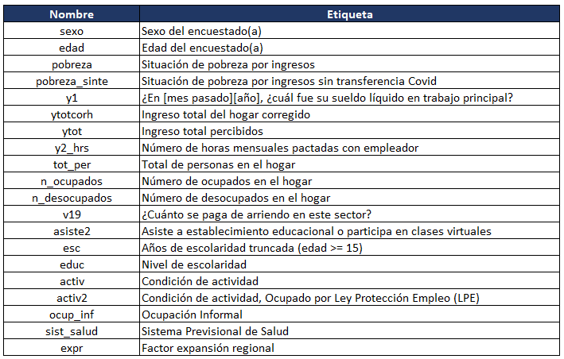
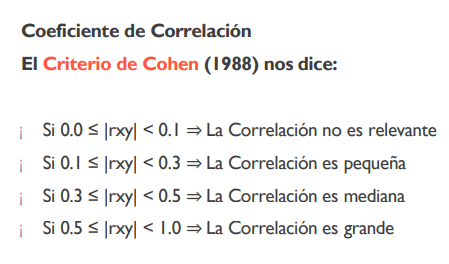

```{r setup, include=FALSE}
knitr::opts_chunk$set(warning = FALSE, message = FALSE)
```

```{r,echo=FALSE, out.width="65%",fig.align="center"}
knitr::include_graphics("./images/politai.jpg") 
```

# **CORRELACIÓN:** 

- La correlación es una medida de la relación (covariación) entre dos variables cuantitativas (numéricas).

- El Coeficiente de Correlación de Pearson o Spearman determinará la Correlación entre las dos variables cuantitativas.

- Solo con el Coeficiente de Correlación de Pearson o Spearman podemos determinar tanto la existencia de correlación como el tipo e intensidad de la relación. 

- El Coeficiente de Correlación de Pearson o Spearman va de -1 a 1.

- “El Coeficiente de Correlación de Pearson es un estadístico paramétrico, pues se asume que ambas variables tienen una distribución aproximadamente normal, o sea, distribución normal bivariante”

- A partir de las pruebas de normalidad, se generan pruebas paramétricas (Pearson) y pruebas no paramétricas (Spearman/Kendall).

## Supuestos...

- Normalidad = **Teorema Central del Límite** (Ritchey, 2006) plantea que, en la medida que nuestro marco muestral es suficientemente grande (mayor a 121 casos), la variable aleatoria se aproxima a un comportamiento normal (p.214 del Cap.7).

- Para analizar correlación se requiere que exista normalidad en ambas variables:

  - Pruebas de Normalidad:
      - Shapiro wilk: prueba para n < a 50 (data pequeña)
      - Kolmogorov Smirnov: prueba para n > a 50 (data grande)

  - Hipótesis de la Normalidad:
      - H0 = Los datos proceden de una distribución normal/la variable presenta una distribución normal/hay normalidad
      - H1 = ~H0

  - P-value:
      - Mayor a 0.05: SÍ hay normalidad y se usa R de Pearson. 
      - Menor a 0.05: NO hay normalidad y se usa R de Spearman. 


## Pero recordemos las relaciones espurias...

```{r,echo=FALSE, out.width="90%",fig.align="center", fig.cap="Fuente: Alzás, V., et al. (2017). Ojito con la Estadística. https://matematicas.unex.es/wp-content/uploads/2017/09/CDE17A04_ojito_con_la_estadistica.pdf"}
  # Para plotear cualquier imagen
# Puedes centrar, aumentar o disminuir el tamaño del gráfico (buscar códigos en internet) 
```


## **5 Pasos para el análisis de correlación**

```{r,echo=FALSE, out.width="115%",fig.align="center", fig.cap="Fuente: Benites, A... & Rodríguez, A. (2022). PPT curso de POL278 - Estadística para el análisis político 1 - 2022-1"}

```

0. Identificar las variables y supuesto

    - Formateo de las variables (si fuese necesario)
    - Identificar normalidad

1. Determinar la H0 (Hipótesis nula) - H1 (Hipótesis alternativa)

    - H0 = No existe correlación entre las variables 
    - H1 = Sí existe correlación entre las variables

2. Seleccionar y aplicar la prueba estadística correspondiente

    - "Coeficiente de Pearson o Spearman"
  
3. Determinar el p-value, luego apruebas o rechazas la H0

    - p < 0.05 Rechazas la H0/Aceptas la H1
  
    - P > 0.05 Aceptas la H0/Rechazas la H1

4. Identificar Coef de Pearson/Spearman y determinar tipo e intensidad de la relación (parte interpretativa)

    - Correlación positiva o negativa (depende del signo del coeficiente)
    - Correlación fuerte, moderada o débil
  
5. Extra: Gráficos de Dispersión

    - Pueden realizarse antes del paso 2 (para darse una idea previa de la relación)
    - Pueden realizarse como último paso (para generar una visualización gráfica de la relación)
  

# **Aplicación práctica**

Hoy, vamos a trabajar con la Encuesta Casen de Chile. Una encuesta parecida a la Enaho. De esta encuesta, nos interesa realizar un breve análisis sobre la población migrante y situación actual (2020, contexto de pandemia). 

La Encuesta Casen es una encuesta a hogares, de carácter transversal y multipropósito, realizada por el Ministerio de Desarrollo Social y Familia (antes Ministerio de Planificación y Cooperación). Ha sido levantada de manera regular en el país desde 1987*. Hasta la fecha, se han realizado 15 versiones de la Encuesta en los años 1987, 1990, 1992, 1994, 1996, 1998, 2000, 2003, 2006, 2009, 2011, 2013, 2015, 2017 y 2020. En particular, los objetivos de la versión 2020, llamada Encuesta Casen en Pandemia 2020, son los siguientes: Conocer la situación de pobreza por ingresos de las personas y los hogares, así como la distribución del ingreso de los hogares, identificar carencias de la población en las áreas de educación, salud, vivienda, trabajo e ingresos, evaluar brechas de pobreza por ingresos y carencias entre distintos grupos de la población como niños, niñas y adolescentes, jóvenes, personas mayores, mujeres, pueblos indígenas, migrantes, entre otros.

Más información del estudio: 
http://observatorio.ministeriodesarrollosocial.gob.cl/encuesta-casen-en-pandemia-2020

Debido a su extensión de 185 437 casos y 655 variables, se ha generado una selección específica de la población migrante peruana ubicada en Chile, junto con unas 20 variables de interés para realizar el análisis deseado. 

### Carguemos la data:

```{r}
library(rio)
dataperu = import("PERU2020.csv")

# str(dataperu) # Exploremos la BD
# class(dataperu)
# names(dataperu)
```

### Configuración de variables:

```{r,echo=FALSE, out.width="100%",fig.align="center"}
 
```

1. Formateo de variables

    - interger o character, y queremos convertirlas a numéricas. Debemos cambiar a un grupo de variables a numérica (`as.numeric`) a través del comando
comando `lapply`.

```{r}
# Forma corta de cambiar la configuración:
dataperu[, c(2, 7:10, 14, 20)] = lapply(dataperu[, c(2, 7:10, 14, 20)], as.numeric) 
#str(dataperu)

#dataperu$y2_hrs = as.numeric(dataperu$y2_hrs)
```

2. Datos perdidos: 

```{r}
sum(is.na(dataperu)) # ¿Cuántos NA tiene nuestro dataframe?
sum(is.na(dataperu$edad)) # aquí, no hay perdidos

sum(is.na(dataperu$y2_hrs)) # aquí, sí hay perdidos

dataperu1 = dataperu[complete.cases(dataperu$y2_hrs),] 
# imputando perdidos de "y2_hrs" #dataperu nueva incluyendo las variables,
```

### Vamos a imputar otros NA's de nuestras variables de acuerdo a nuestro análisis en particular.


# **Análisis breve de la población migrante peruana en Chile**

A continuación, a partir de los siguientes ejercicios, vamos a caracterizar y analizar relaciones entre variables de interés para esta población. Las variables son numéricas. Resolveremos el ejercicio 1 y el resto es tarea para ustedes. Pueden solicitar el solucionario de códigos a través de mi correo, luego de enviar su resolución!

  - OBS: 1000 pesos chilenos <> 4.9 soles peruanos. NO implica que realicemos la conversión (solo es para conocimiento).


## Ejercicio 1: relación entre la edad de la población migrante peruana ("edad") y sus ingresos percibidos ("ytot"). 

Paso 1. Identificar las variables y supuesto

  - variables: `edad` y `ytot`
  - (EDAD -> VI / ingresos -> VD)   
  
```{r}
# Hay casos perdidos?
summary(dataperu$edad)
summary(dataperu$ytot)
```

```{r}
str(dataperu$edad)
str(dataperu$ytot)

sum(is.na(dataperu$ytot)) # Total de casos perdidos

ejercicio1 = dataperu[complete.cases(dataperu$ytot),] 
# creando una nueva base de datos con los casos completos, borramos los casos 
# perdidos especificos

sum(is.na(ejercicio1$ytot))
```

   - SUPUESTO de NORMALIDAD
   
   1. Hipótesis de la Normalidad: 
   
   - H0 = Los datos proceden de una distribución normal/la variable presenta una distribución normal/hay normalidad
   
   - H1 = Los datos no proceden de una distribución normal/la variable no presenta una distribución normal/no hay normalidad
   
   2. Pruebas de Normalidad:
   
   - Shapiro wilk: prueba para n < a 50 (dataperu pequeña)
   - Kolmogorov Smirnov: prueba para n > a 50 (dataperu grande) ---> aplicaremos esto pues en este caso hay 993 casos (fijate siempre en environment)
   
```{r}
#install.packages("nortest") #solo para kolmogorov necesitamos este paquete
library(nortest)
lillie.test(ejercicio1$edad) #Kolmogorov smirnov
#shapiro.test(ejercicio1$edad) #probemos cómo sale con shapiro
```

INTERPRETACIÓN:

  - Con respecto a la prueba de normalidad Kolmogorov smirnov de la variable edad, el p-value es menor a 0.05, por tanto, rechazamos la H0 y concluimos que la variable edad no presenta una distribución normal.

```{r}
###pruebas alternativas a la normalidad
#ad.test(ejercicio1$edad) #Anderson-Darling
#sf.test(ejercicio1$edad) #Shapiro-Francia
#cvm.test(ejercicio1$edad) #Cramer-von Mises
```

ahora con la variable ingresos totales
```{r}
lillie.test(ejercicio1$ytot) #Kolmogorov smirnov
```
INTERPRETACIÓN:

Con respecto a la prueba de normalidad Kolmogorov smirnov de la variable ingresos totales el p-value es menor a 0.05, por tanto, rechazamos la H0 y concluimos que la variable ingresos totales no presenta una distribucion normal.

 -> Conclusión: No hay normalidad en ninguna variable, por lo que debiéramos usar el Coeficiente de Spearman. 


Paso 2. Determinar la H0 - H1
   - H0 = No existe correlación entre la edad y los ingresos de la persona
   - H1 = Sí existe correlación entre la edad y los ingresos de la persona

Paso 3. Seleccionar y aplicar la prueba estadística
  - "Coeficiente de Spearman"
  aquí están las dos pruebas
Las dos lineas son para una distribución normal: Pearson
pero la última sirve para los dos, solo reemplaza
```{r}
# Pruebas Pearson:
#cor(ejercicio1$edad, ejercicio1$ytot) 
# La función `cor` sirve para analizar correlaciones tipo matriz

#cor.test(ejercicio1$edad, ejercicio1$ytot)  
# La función `cor.test` analiza la significancia de la correlacion, utilizando el contraste t-student. # Pearson

# Forma corta:
cor.test(ejercicio1$edad, ejercicio1$ytot, method = c("spearman")) 
# Con el argumento `method` también se puede especificar la prueba Pearson
# en caso se cumpliera con la normalidad 
```

Paso 4. Determinar el p-value y apruebas o rechazas H0

                                      "¿HAY CORRELACIÓN?"
                                      
Interpretación: Debido a que es menor a < 0.05, rechazamos la H0 y, por tanto, aceptas la H1 de que "sí existe correlación entre las variables edad e ingresos".

Paso 5. Identificar Coef de Spearman y determinar tipo e intensidad de la relación

                 "¿SENTIDO DE LA RELACIÓN?" Y "¿INTENSIDAD DE LA RELACIÓN?"

Interpretación: El Coeficiente de Spearman (RHO) es de 0.06 (6%) quiere decir:
- Se trata de una "correlación positiva"; es decir, relación directa (a medida de que la edad aumenta, los ingresos que se perciben aumentan). 
- Se trata de una "correlación no es relevante". En efecto, según el criterio de Cohen, la correlacion se encuentra en el rango entre 0.0 y 0.1.

```{r,echo=FALSE, out.width="100%",fig.align="center"}
 
```


Paso 6. Extra: Gráficos de Dispersión

 - Visualiación gráfica 1 con ggplot2
```{r}
# `with` es la función que sirve para juntar las dos variables a covariar
# `pch = 20` es la forma circular de los puntos de dispersión
with(ejercicio1, plot(x = edad, y = ytot, pch = 20, col = 'blue',
                      xlab = 'Edad', las = 1, 
                      ylab = 'Ingresos')) 
```

60, INGRESO ALTO: HAY UN CASO ATIPICO
NO VEMOS UN PATRON CLARO. LA CORRELACION ES TAN BAJA, POR ESO SE MUESTRA ASÍ.

 - visualización gráfica 2:
 
```{r}
#install.packages("PerformanceAnalytics")
# Permite correlacionar y genera el coef de correlación en el gráfico:
library(PerformanceAnalytics) 

# Nuestros datos es mejor tenerlos en un dataperu.frame:
ejercicio1.1 <- data.frame(ejercicio1$edad, ejercicio1$ytot) 
chart.Correlation(ejercicio1.1) 
```
  - LA MAYORÍA PERCIBE SUS INGRESOS COMO BAJOS 

# **II.2. Matriz de correlaciones ** ELEMENTO IMPORTANTE. NOS PERMITE VER 

POR EJEMPLO, TENEMOS 5 VARIABLES DE INTERES 
NOS CALCULA LA CORRELACION DE TODAS LAS VARIABLES

```{r}
str(dataperu)
datos.cuanti <- dataperu[, c(2, 5:10)]
str(datos.cuanti) #SOLO PARA VER NUESTRA ULTIMA BASE CREADA
# La siguiente instrucción para editar los nombres de la variables

colnames(datos.cuanti) <- c('Edad', 'Hogar$', 'Ingresos', 'Horas', '#Hogar', 
                            'Trabajan', 'NoTrabajan') # CAMBIAR EL NOMBRE DE NUESTAS VARIABLES
str(datos.cuanti)


# ELIMINAR CASOS PERDIDOS DE UN GRUPO DE VARIABLES DE INTERES:
sum(is.na(datos.cuanti))
datos.cuanti = datos.cuanti[complete.cases(datos.cuanti), ] 
# imputamos los perdidos de toda la BD, lo que ajustará más los coeficientes 
# resultantes de los test estadísticos.


# LUEGO CREAMOS:
M <- round(cor(datos.cuanti), digits = 2) 
# ROUND --> REDONDEAR, LUEGO QUE SAQUE LA MATRIZ DE CORRELACION DE 
# ENTRE TODAS LAS VARIABLES (COR). DIGIT: REDONDEANDO A 2 VARIABLES

M # la matriz de correlaciones entre las variables cuantitativas.
```

#Visualización gráfica de Matriz de correlación
```{r}
#install.packages("corrplot") 
library('corrplot') 
corrplot.mixed(M)
```
MÁS AZUL, SE ACERCA AL 1
ROJO, SE ACERCA A UNA RELACION INVERSA FUERTE -1
AL BLANCO SE ACERCA MÁS AL CERO RELACION BAJA

#TAMBIEN NOS SIRVE PARA COMPARAR VARIABLES ESPECIFICAS 

ANALIZAR UNA VARIABLE EN ESPECIFICO O EN GENERAL (VER QUÉ VARIABLES TIENEN LA CORRELACION MÁS ALTA Y BAJA)


# **Practiquemos con más ejercicios!**

  - Ejercicio 2. Queremos analizar la relación entre los ingresos percibidos ("ytot") y los ingresos del hogar ("ytotcorh").

  - Ejercicio 3. Queremos analizar la relación entre los ingresos percibidos ("ytot") y las horas mensuales de trabajo ("y2_hrs").

  - Ejercicio 4. Queremos analizar la relación entre los ingresos del hogar ("ytotcorh") y el número total de personas ("tot_per")

  - Ejercicio 5. Queremos analizar la relación entre el número de personas que laboran en el hogar ("n_ocupados") y quienes no ("n_desocupados").

Nota: Enviar solo la resolución de estos ejercicios en formatos Rmd y HTML al siguiente correo: a20196510@pucp.edu.pe

***HINT:***

  1. Prueba de normalidad
  2. Prueba de Spearman o Pearson
  3. Gráfico de dispersión
  4. Interpretar

# Ejercicio en clase

## IDH, PEDRO CASTILLO Y HERNANDO DE SOTO?...

El Índice de Desarrollo Humano (IDH) es un indicador que evalúa el progreso general de un país en tres áreas fundamentales de desarrollo: la salud y esperanza de vida, el acceso a la educación y conocimiento, y el nivel de vida digno. Su objetivo principal es ampliar la perspectiva de medición del desarrollo más allá del Producto Interno Bruto (PIB), buscando reflejar de manera más precisa la calidad de vida y bienestar de los habitantes en cada nación.

- Utilicemos la base de datos creada por la profesora Marýlia Cruz.

## Escojamos tres variables (numéricas):

  `IDH`:

- Cercano a 1 = Mejor desarrollo humano

- Cercano a 0 = Peor desarrollo humano

  `VotosV_Castillo`: Porcentaje de votos válidos para De Soto

  `VotosV_De_Soto`: Porcentaje de votos válidos para De Soto


## ¿Habrá correlación entre el IDH de los distritos electorales del país y estos candidatos?

```{r}
# Importamos el df:
library(rio) # Tambien corre con comillas: library("rio")
datavotos <- import("PVotos_CirElectoral_idh.xlsx")
```

```{r}
# Procesamiento de data:
#names(datavotos)
#str(datavotos)
#summary(datavotos) # Adverir NA's
```

```{r}
# Borrar NA's en determinadas columnas:

# En este caso, no hay NA's, pero sería así en una nueva subdata:

#datavotos1 = datavotos[complete.cases(datavotos$IDH),]
#datavotos1 = datavotos[complete.cases(datavotos$VotosV_Castillo),]
#datavotos1 = datavotos[complete.cases(datavotos$VotosV_De_Soto),]

# Nota: No olvidar que hay encuestas que presentan NA's de la siguiente forma:
#data1$vart[data1$vart == 888888]= NA 
# Después de Convertirlas en NA's, procedemos con el código de arriba:
#data1 = data1[complete.cases(data1$vart),]

# Finalmente para comprobar la limpieza, corremos summary de nuevo:
#summary(datavotos) # Adverir NA's
```

# **PASO 1: Verificamos el supuesto de normalidad**

  - Para analizar correlación se requiere que exista normalidad en ambas variables.

  - Realizo la prueba de normalidad para definir si empleo Pearson o Spearman. Recordar que cuando el número de casos es menor a 121, utilizo la prueba de Spearman.

Recordar 2 pruebas de normalidad:

`lillie.test(ejercicio1$edad)` # Kolmogorov smirnov -> prueba para n > a 50 (data grande)

`shapiro.test(ejercicio1$edad)` # shapiro wilk -> prueba para n < a 50 (data pequeña)

(Luego de hacer la prueba en las dos variables, verificamos la H0) 

- La H0 de la prueba de normalidad: HAY NORMALIDAD / la variable se distribuye normalmente

- La H1: ~H0

```{r}
# Hipótesis de normalidad para las 3 variables:
shapiro.test(datavotos$IDH)
shapiro.test(datavotos$VotosV_Castillo)
shapiro.test(datavotos$VotosV_De_Soto)

#install.packages("nortest") # Para kolmogorov necesitamos este paquete
#library(nortest)
#shapiro wilk -> prueba para n < a 50 (data pequeña)

```

IDH:

+ Con respecto a la prueba de normalidad shapiro wilk de la variable `IDH`, el p-value (0.6605) es mayor a 0.05, por tanto, aceptamos la H0 y concluimos que esta variable presenta una distribución normal.

Castillo:

+ Con respecto a la prueba de normalidad shapiro wilk de la variable `VotosV_Castillo`, el p-value (0.07519) es mayor a 0.05, por tanto, aceptamos la H0 y concluimos que esta variable  presenta una distribución normal.

De Soto:
  
+ Con respecto a la prueba de normalidad Kolmogorov smirnov de la variable `VotosV_De_Soto`, el p-value (0.01307) es menor a 0.05, por tanto, rechazamos la H0 y concluimos que esta variable no presenta una distribución normal.


# **PASO 2: Seleccionamos la prueba y determinamos si existe correlación**

  - Determinar el p-value y apruebas o rechazas H0. 
  - Prueba de correlación (el método se precisa en el argumento de la función)

A) IDH Y CASTILLO:

  - LA H0: NO EXISTE CORRELACION 

```{r}
cor.test(datavotos$IDH, datavotos$VotosV_Castillo, method = c("pearson"))
# Nota: CORT TEST - VARIABLE X - VARIABLE Y - EL METODO
```

Interpretación: 

  + Al revisar el P-value (0.008096), el cual es menor a 0.05, rechazamos la H0 y, por tanto, aceptamos la H1. A un 95% del nivel de confianza, sí parece existir una relación entre las variables IDH idh y el porcentaje de voto válidos a favor de Pedro Castillo.
  
  
# **PASO 3: Determinamos la fuerza de la correlación**
  
*O HAY EVIDENCIA ESTADISTICA SUFICIEnTE PARA AFIRMAR O NO LA HAY PARA NEGAR LA RELACION.*

  + El Coeficiente de Pearson (COR) es de 0.5077587 (50%). 

# **PASO 4: Determinamos el sentido de la correlación** 

*Guiarse de la tabla de criterio de Cohen y de los resultados obtenidos* 

  + Por tanto, se trata de una correlación negativa; es decir, la relación es inversa: a medida de que el IDH aumenta, hay menor porcentaje de votos a favor Castillo.  

  + Además, se trata de una correlación que es grande. En efecto, según el criterio de Cohen, la correlación se encuentra en el rango entre 0.5 y 1.0. 

*Acá reflexionar respecto a las afirmaciones*:

  - por ejemplo: las personas que tengan los servicios básicos cubiertos (buen idh), registraron menor posibilidad que voten por un candidato outsider y con una agenda radical. 
  - Representantes nuevos. 
  - Voto antisistema, no en la norma.
  - Profundizar qué pasa en esas regiones que votaron así.

## En suma, ver más allá de lo evidente:

  - *Story telling*: 
    - Importante en cómo se comunica la evidencia estadística. Para ello es necesario manejar una argumetnación de interpretación de los datos.
    - Iniciar una discusión, contribuir a la academia, entre otros.

# **PASO 5: Gráfica de dispersión `ggplot2`**

A través del gráfico podemos percibir el sentido de la relación

  - usualmente eje X: variables que suceden primero (VARIABLES INDEPENDIENTES)

```{r}
library(ggplot2)
ggplot(datavotos, aes(x = IDH, 
                      y = VotosV_Castillo)) + 
  geom_point(colour = "red")
```

Interpretación:

  + RELACIÓN QUE PARECIERA SER INVERSA (MENOS IDH, MAYOR VOTO POR CASTILLO)

# B) IDH y De Soto:

```{r}
cor.test(datavotos$IDH, 
         datavotos$VotosV_De_Soto, 
         method = c("spearman"))
```

Interpretación: 

  + Al revisar el P-value (1.539e-06), el cual es menor a 0.05, rechazamos la H0 y, por tanto, aceptamos la H1. A un 95% del nivel de confianza, sí parece existir una relación entre las variables IDH Y el porcentaje de votos válidos a favor De Soto.

  + El Coeficiente de Spearman (RHO) es de 0.8988034 (89%). 

  + Por tanto, se trata de una correlación positiva; es decir, la relación es directa: a medida de que el IDH aumenta, hay mayor porcentaje de votos válidos a favor de De Soto. 

  + Además, se trata de una correlación que es grande. En efecto, según el criterio de Cohen, la correlación se encuentra en el rango entre 0.5 y 1.0. 


## Gráfico de dispersión

```{r}
library(ggplot2)
ggplot(datavotos, aes(x = IDH, 
                      y = VotosV_De_Soto)) + 
  geom_point(colour = "blue")
```

Interpretación:

  + La correlación entre el `IDH`  y  `VotosV_De_Soto` presenta una relación fuerte y directa (+IDH, +REGIONES VOTAN). SENTIDO: POSITIVO


# Ahora que se ha comprobado la correlación, podemos continuar con el modelamiento de las variables... es decir, realizar un regresión lineal (múltiple).

--------------------------------------------------------------------------------

# PLUS: Recordar 2 formas para recodificar variables:

- Usemos la misma base de datos, por ejemplo:

1) Uno a uno:

```{r}
str(datavotos$Distrito.electoral)
# Ojo, esta variable es chr (cualitativa), necesitamos convertirlo a numérica
```
Costa = 1
Sierra = 2
Selva = 3

```{r}
datavotos$region[datavotos$Distrito.electoral == 'Amazonas'] = 'Selva' # AQUÍ TAMBIÉN PODEMOS COLOCAR 1 en LUGAR DE SELVA
datavotos$region[datavotos$Distrito.electoral == 'Ancash'] = 'Sierra'
datavotos$region[datavotos$Distrito.electoral == 'Apurimac'] = 'Sierra'
```

```{r}
table(datavotos$region) # Revisemos la recodificación:
```

2) Usando recode:

```{r}
library(car)
datavotos$region2 = recode(datavotos$Distrito.electoral,
                           "'Amazonas'='Selva';'Ancash'='Sierra'")
```

```{r}
table(datavotos$region2) # Revisemos la recodificación:
```

AQUÍ, FALTA DEFINIR (SE HACE UNO POR UNO)

# **Más recursos**:

-   [Códigos del curso Estadística para el análisis político I](https://github.com/Pruebas-Estadistica-2/REPASO-CODES)

-   [dataperu Política: Manual R para estadística aplicada al análisis político. dataperu Política: Lima.](https://christianchiroquer.github.io/ManualdeR/r-un-lenguaje-de-programaci%C3%B3n.html)

-   [Tipos de variables y escalas de medición](https://www.odiolaestadistica.com/estadistica-r/tipos-de-variables/)


